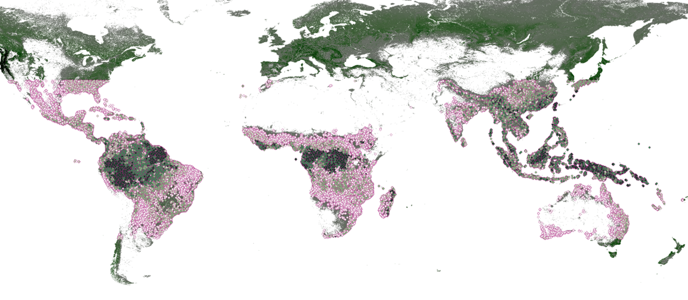
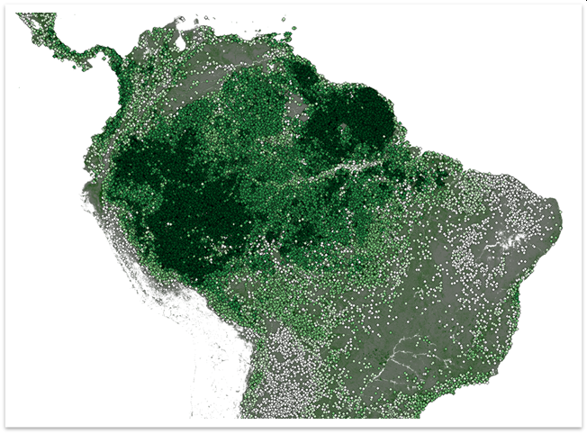
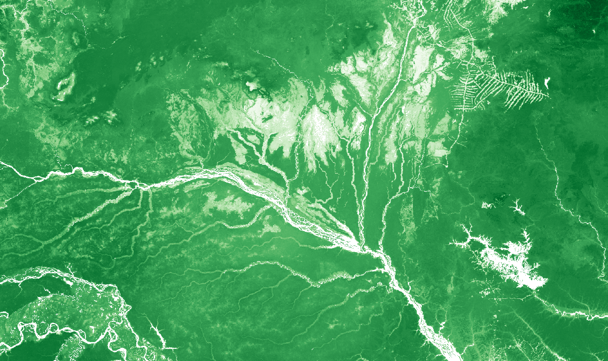
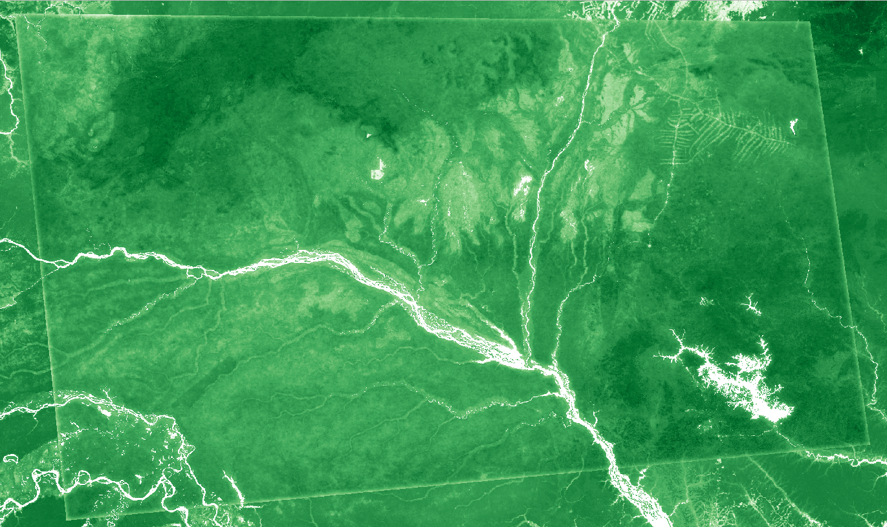
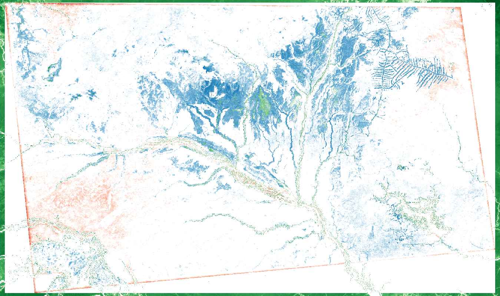
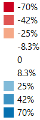

.. default-role:: code

Spatially Dependent Global Carbon Model
=======================================

This model predicts biomass density in a landscape given a georeferenced spatial map indicating regions of cropland, urban, forest, and other landcover types. The underlying model is complex, capturing the relationships between local and distant biological, geological, and human factors.

Training the Model
------------------

The model trains off of a set of fixed predictors that will always be present in any model run (biophysical quantities) and a landcover derived set of predictors provided by the user when running predictions. The landcover raster will be filtered to extract forest, urban, and agriculture masks. Response carbon stock data is associated with the same year as the landcover predictor data.

Step 1 -- Align/Project base rasters
************************************

Place all the rasters you want to use in the model including predictors and response variable in a folder.

``python align_rasters_for_carbon_model.py path_to_raster_folder/*.tif``

This creates a directory called ``processed_rasters/aligned_rasters`` which is a copy of all the rasters in the base folder but aligned and projected into the same dimensions.

Step 2 -- Extract landcover type masks
**************************************

In this step the landcover rasters are processed into forest, urban, and crop mask rasters. These are used to identify where the model should be run (forest only) but also in a later step to measure any distance weighted influence from those landcover types. To extract masks from any number of ESA landcover rasters run the following command

``python extract_landcover_masks.py processed_rasters/aligned_rasters/[landcover pattern].tif``

This script expects landcover rasters to be in the ESA format with the following classifications:
  * cropland: 10-41
  * urban 190
  * forest: 50, 60, 61, 62, 70, 71, 72, 80, 81, 82, 90, 160, 170

For each file matched in the pattern, 3 files are generated preprended with
``cropland``, ``urban``, or ``forest``.

Step 3 -- Calculate distance weighted influence
***********************************************

0.45 and 1.4

Running the Model
-----------------

Step 1 -- Create a simple landcover classification
**************************************************

(This step is not necessary if you already have a raster defined as below)

This model uses 4 landcover types to help predict forest carbon:

 * 1: cropland
 * 2: urban
 * 3: forest
 * 4: other landcover types

This model includes a script ``utils/esa_to_carbon_model_landcover_types.py`` to help with this process. It can be called at the command line as follows:

``python utils/esa_to_carbon_model_landcover_types.py esa_lulc.tif carbon_model_landcover_types.tif --clipping_shapefile_path aoi.gpkg``

Here, ``esa_lulc.tif`` is the base ESA landcover map, ``carbon_model_landcover_types.tif`` is the desired output raster which is the conversion of the ESA landcover map to a 1-4 integer mask suitable for this model, and ``--clipping_shapefile_path aoi.gpkg`` is an optional argument to that can clip the base ``esa_lulc.tif`` raster to a smaller area of interest and/or reprojection.

Step 2 -- Run the Carbon Model
******************************

This step requires that you have a raster with the four landcover types described in Step 1. that raster is called ``carbon_model_landcover_types.tif`` the model can be run as follows:

``python carbon_edge_model.py --landcover_type_raster_path carbon_model_landcover_types.tif``

This script will make a directory in the current directory called ``carbon_model_workspace``. When complete, the root of this directory will contain the output file ``biomass_per_ha_stocks_{mask}.tif'`` where ``mask`` is the basename of the input landtype mask raster.

Note: this model requires several gigabytes of global data to operate. When the model is run for the first time it will automatically download these data to a subdirectory in the workspace named ``data``. As long as the same workspace is used on subsequent runs, the model will reuse those
data rather than re-download.

Installing Dependencies
-----------------------

The Python dependencies for this model are listed in ``requirements.txt`` but it also requires that the Google Cloud SDK be installed. To simplify this requirement we provide a Docker image that can be used to run the model without any additional dependency requirements. It can be run as follows:

(Windows)
*********

``docker run --rm -it -v "%CD%":/usr/local/workspace therealspring/inspring:latest carbon_edge_model.py mask.tif``

(Linux)
*******

``docker run --rm -it -v `pwd`:/usr/local/workspace therealspring/inspring:latest carbon_edge_model.py mask.tif``

Utility Scripts
---------------

The following utility scripts are available in ``./utils``

 * ``create_marginal_value.py`` used to subtract one raster from another of to create a marginal value map. Use as follows:

    ``python utils/create_marginal_value.py --base_value_raster_path base.tif --scenario_value_raster_path scenario.tif --target_marginal_value_path marginal_value.tif``

 * ``esa_to_carbon_model_landcover_types.py`` used to convert an ESA style landcover map into the 4 catagory landcover map used in this model. Described above in **Step 1 -- Create a simple landcover classification**.

Model Builder
-------------

The ``model_builder`` contains Python code to build the regression model used by ``carbon_edge_model.py`` it need not be run by an end user but instead is provided as reference.

Directories
-----------

 * ``model_base_data`` will be generated by the ``carbon_edge_model.py`` script and will contain base data for future runs to avoid large downloads per evaluation. It should not be modified by hand.
 * ``model_run_workspace`` is the root workspace for a particular model run defined by a given landcover scenario, this directory will contain
    * ``churn`` a directory to hold intermediate files that are not useful for human inspection, and
    * ``biomass_per_ha_stocks_{base_landcover_type_raster_path_id]}.tif`` -- the output of the model.

Model Analysis
--------------

The model was generated by randomly sampling forest pixel points distribued evenly on a sphere from 35N to 35S latitude (subtropics).

against 64,000 points using the method described above.

Goodness of fit
***************

The table below shows the results of several training runs. The first column was the number of points selected for the model using the method in the previous section. The `r_squared` vs `r_squared_test` are the R^2 scores calculated on the training data and the holdout data respectively. In each instance 80% of the points were used for training while 20% were held out for validation. We gain confidence that the model is accurate and not overfitting at around 320,000 points but we get a slightly better R^2 at 640,000.

.. list-table:: R^2 performance vs sample points
   :widths: 25 25 50 2
   :header-rows: 1

   * - n_points
     - r_squared
     - r_squared_test
     - model used
   * - 40000
     - 0.843442966
     - 0.810843161
     -
   * - 80000
     - 0.817260654
     - 0.816668817
     -
   * - 160000
     - 0.813861854
     - 0.814232628
     -
   * - 320000
     - 0.811147318
     - 0.769127539
     -
   * - 640000
     - 0.864520049
     - 0.810522805
     - **<----------**

Example in Local Area
---------------------

Below is modeled data compared against global Baccini biomass layer:

Baccini Biomass Layer:

Modeled Biomass Layer:

Error:

Error legend:

Data
****

Data required for this model are automatically fetched from public Google Bucket storage (located at the root ``https://storage.googleapis.com/ecoshard-root/global_carbon_regression/inputs``). This includes the rasters listed below as well a ``scikit.learn`` pickled regression model trained using the method above.

    * ``accessibility_to_cities_2015_30sec.tif``
    * ``ACDWRB_10sec.tif``
    * ``altitude_10sec.tif``
    * ``AWCh1_10sec.tif``
    * ``AWCh2_10sec.tif``
    * ``AWCh3_10sec.tif``
    * ``AWCtS_10sec.tif``
    * ``bdod_10sec.tif``
    * ``BDRICM_10sec.tif``
    * ``BDRLOG_10sec.tif``
    * ``BDTICM_10sec.tif``
    * ``bio_01_30sec.tif``
    * ``bio_02_30sec.tif``
    * ``bio_03_30sec.tif``
    * ``bio_04_30sec.tif``
    * ``bio_05_30sec.tif``
    * ``bio_06_30sec.tif``
    * ``bio_07_30sec.tif``
    * ``bio_08_30sec.tif``
    * ``bio_09_30sec.tif``
    * ``bio_10_30sec.tif``
    * ``bio_11_30sec.tif``
    * ``bio_12_30sec.tif``
    * ``bio_13_30sec.tif``
    * ``bio_14_30sec.tif``
    * ``bio_15_30sec.tif``
    * ``bio_16_30sec.tif``
    * ``bio_17_30sec.tif``
    * ``bio_18_30sec.tif``
    * ``bio_19_30sec.tif``
    * ``BLDFIE_10sec.tif``
    * ``cfvo_10sec.tif``
    * ``clay_10sec.tif``
    * ``CLYPPT_10sec.tif``
    * ``CRFVOL_10sec.tif``
    * ``hillshade_10sec.tif``
    * ``HISTPR_10sec.tif``
    * ``livestock_Bf_2010_5min.tif``
    * ``livestock_Ch_2010_5min.tif``
    * ``livestock_Ct_2010_5min.tif``
    * ``livestock_Dk_2010_5min.tif``
    * ``livestock_Gt_2010_5min.tif``
    * ``livestock_Ho_2010_5min.tif``
    * ``livestock_Pg_2010_5min.tif``
    * ``livestock_Sh_2010_5min.tif``
    * ``ndvcec015_10sec.tif``
    * ``night_lights_10sec.tif``
    * ``night_lights_5min.tif``
    * ``nitrogen_10sec.tif``
    * ``ocd_10sec.tif``
    * ``OCDENS_10sec.tif``
    * ``ocs_10sec.tif``
    * ``OCSTHA_10sec.tif``
    * ``phh2o_10sec.tif``
    * ``PHIHOX_10sec.tif``
    * ``PHIKCL_10sec.tif``
    * ``population_2015_30sec.tif``
    * ``population_2015_5min.tif``
    * ``sand_10sec.tif``
    * ``silt_10sec.tif``
    * ``slope_10sec.tif``
    * ``soc_10sec.tif``
    * ``tri_10sec.tif``
    * ``wind_speed_10sec.tif``
    * ``baccini_10s_2014_md5_5956a9d06d4dffc89517cefb0f6bb008.tif``

Coefficents
***********

Below is a truncated version of the normalized coefficients used in the 640,000 point model. A complete and searchable table of factors and can be found at: https://github.com/therealspring/carbon_edge_model/blob/master/images/coef_640000.csv

.. list-table:: Truncated Coefficient Table (full table at https://github.com/therealspring/carbon_edge_model/blob/master/images/coef_640000.csv)
   :widths: 25 25
   :header-rows: 1

   * - Coefficient
     - Feature Term
   * - `+1.084e+02`
     - `urban_gf*forest_gf`
   * - `+5.622e+01`
     - `cropland_gf^2`
   * - `+5.146e+01`
     - `cropland_gf*forest_gf`
   * - `+4.534e+01`
     - `forest_gf^2`
   * - `-3.438e+01`
     - `cropland_gf*urban_gf`
   * - `-1.537e+01`
     - `urban_gf^2`
   * - `-9.928e+00`
     - `phh2o_10sec`
   * - `-9.519e+00`
     - `bio_11_30sec*urban_gf`
   * - `+6.126e+00`
     - `AWCh3_10sec`
   * - `-5.611e+00`
     - `bio_02_30sec*forest_gf`
   * - `-5.002e+00`
     - `PHIKCL_10sec`
   * - `-4.264e+00`
     - `bio_10_30sec*urban_gf`
   * - `+4.188e+00`
     - `tri_10sec*urban_gf`

License
-------

This software is permissively licensed under The Apache 2.0 open source license.

